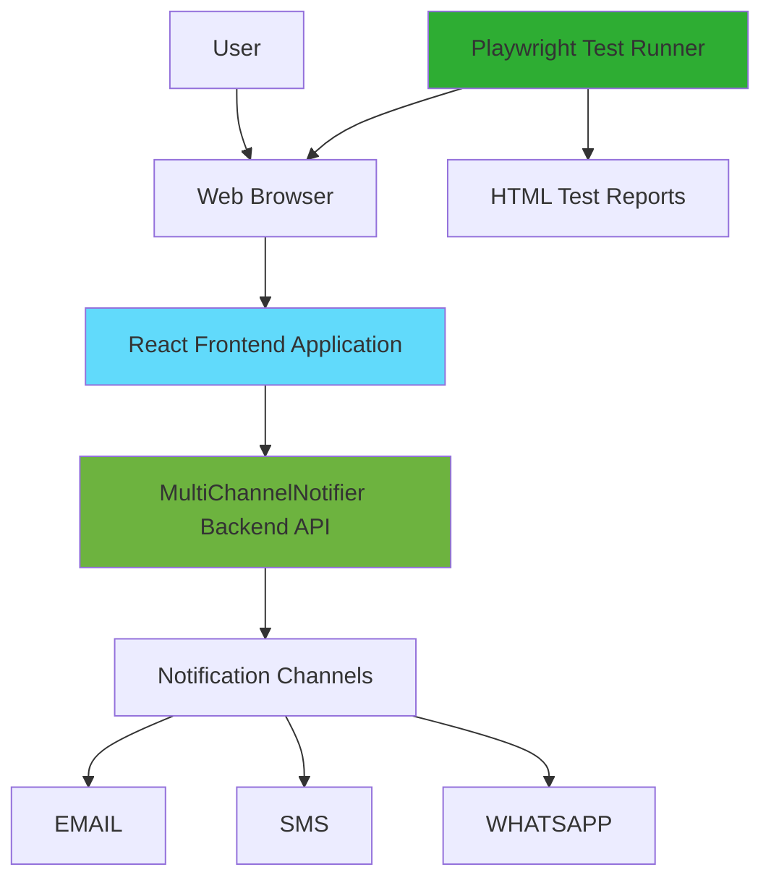
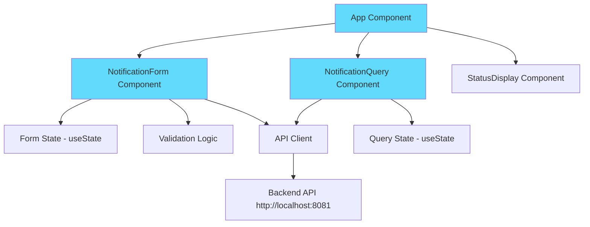
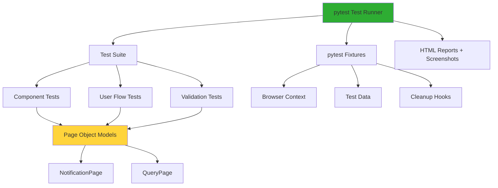
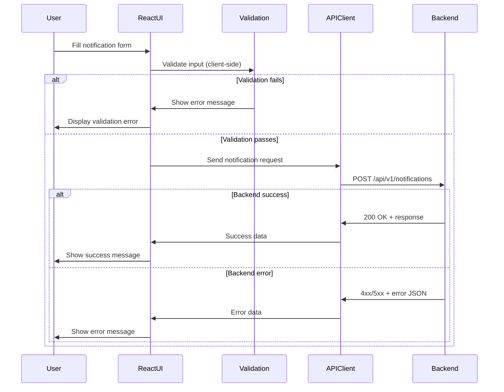

# Design Document

## Overview

The Notification E2E Suite is a comprehensive testing solution consisting of two main components:

1. **React Frontend Application**: A minimal web interface that allows users to interact with the MultiChannelNotifier backend system through a clean, modern UI
2. **Playwright E2E Test Suite**: A Python-based automated testing framework that validates the frontend application and user flows

### Key Design Principles

- **Separation of Concerns**: Clear boundaries between UI components, state management, API integration, and testing layers
- **Test-Driven Validation**: E2E tests focus on frontend behavior and user experience, not backend logic
- **Modern React Patterns**: Functional components with hooks for state management and side effects
- **Test Isolation**: Each test runs independently with proper setup and teardown
- **Maintainability**: Page Object Model pattern for test organization and reusability

### Technology Stack

**Frontend:**
- React 18+ (functional components with hooks)
- JavaScript/TypeScript
- Fetch API for HTTP requests
- CSS Modules or styled-components for styling

**Testing:**
- Playwright (Python bindings)
- pytest as test runner
- pytest-playwright plugin
- pytest-html for reporting


## Architecture

### System Architecture



### Frontend Application Architecture




### Test Architecture



### Component Interaction Flow




## Components and Interfaces

### Frontend Components

#### 1. App Component

**Purpose**: Root component that manages application layout and routing

**State**: None (stateless container)

**Props**: None

**Responsibilities**:
- Render main application layout
- Compose NotificationForm and NotificationQuery components
- Provide global styling and theme

**Implementation Pattern**: Functional component

```javascript
function App() {
  return (
    <div className="app">
      <header>
        <h1>Notification E2E Suite</h1>
      </header>
      <main>
        <NotificationForm />
        <NotificationQuery />
      </main>
    </div>
  );
}
```


#### 2. NotificationForm Component

**Purpose**: Form for creating and sending notifications

**State**:
- `type`: Selected notification type (EMAIL, SMS, WHATSAPP)
- `recipient`: Recipient address/phone number
- `message`: Notification message content
- `subject`: Email subject (only for EMAIL type)
- `errors`: Validation error messages object
- `status`: Submission status (idle, loading, success, error)
- `responseMessage`: Backend response message

**Props**: None

**Responsibilities**:
- Render form fields with appropriate validation
- Show/hide subject field based on notification type
- Validate input before submission
- Call API client to send notification
- Display success or error messages
- Clear form after successful submission

**Validation Rules**:
- Type: Required, must be one of EMAIL, SMS, WHATSAPP
- Recipient: Required, format depends on type
  - EMAIL: RFC-compliant email format
  - SMS: Valid phone number for ES region (libphonenumber format)
  - WHATSAPP: E.164 international format with + prefix
- Message: Required, non-empty string
- Subject: Optional for EMAIL, hidden for SMS/WHATSAPP

**Implementation Pattern**: Functional component with useState and useEffect hooks


#### 3. NotificationQuery Component

**Purpose**: Interface for querying notification history

**State**:
- `filters`: Object containing type, status, from, to date filters
- `notifications`: Array of retrieved notifications
- `loading`: Boolean indicating query in progress
- `error`: Error message if query fails

**Props**: None

**Responsibilities**:
- Render filter form with type, status, date range inputs
- Call API client to fetch notifications
- Display results in a table or list format
- Show "no results" message when appropriate
- Handle loading and error states

**Implementation Pattern**: Functional component with useState and useEffect hooks

#### 4. StatusDisplay Component

**Purpose**: Reusable component for displaying status messages

**Props**:
- `type`: 'success' | 'error' | 'info'
- `message`: String message to display
- `onDismiss`: Optional callback for dismissing message

**Responsibilities**:
- Render styled message based on type
- Provide dismiss functionality if callback provided

**Implementation Pattern**: Functional component (presentational)


### API Client Module

**Purpose**: Centralized module for all backend API communication

**Functions**:

```javascript
// Send notification
async function sendNotification(notificationData) {
  // POST to /api/v1/notifications
  // Returns: { success: boolean, data: object, error: object }
}

// Query notifications
async function queryNotifications(filters) {
  // GET to /api/v1/notifications with query params
  // Returns: { success: boolean, data: array, error: object }
}

// Error handler
function handleAPIError(response) {
  // Parse error JSON with status, timestamp, message, description
  // Return structured error object
}
```

**Error Handling Strategy**:
1. Check HTTP status code
2. If 4xx or 5xx, attempt to parse error JSON
3. Verify response_status field matches HTTP status
4. If JSON is malformed or missing fields, fail silently (no error message)
5. Return structured error object or null

**Implementation**: Pure JavaScript module with fetch API


### Test Components

#### Page Object Models

**NotificationPage Class**:

```python
class NotificationPage:
    def __init__(self, page):
        self.page = page
        self.type_select = page.locator('[data-testid="notification-type"]')
        self.recipient_input = page.locator('[data-testid="recipient"]')
        self.message_input = page.locator('[data-testid="message"]')
        self.subject_input = page.locator('[data-testid="subject"]')
        self.submit_button = page.locator('[data-testid="submit"]')
        self.status_message = page.locator('[data-testid="status-message"]')
    
    async def navigate(self):
        await self.page.goto('http://localhost:3000')
    
    async def select_type(self, notification_type):
        await self.type_select.select_option(notification_type)
    
    async def fill_form(self, type, recipient, message, subject=None):
        await self.select_type(type)
        await self.recipient_input.fill(recipient)
        await self.message_input.fill(message)
        if subject and type == 'EMAIL':
            await self.subject_input.fill(subject)
    
    async def submit(self):
        await self.submit_button.click()
    
    async def get_status_message(self):
        return await self.status_message.text_content()
    
    async def is_subject_visible(self):
        return await self.subject_input.is_visible()
```


**QueryPage Class**:

```python
class QueryPage:
    def __init__(self, page):
        self.page = page
        self.type_filter = page.locator('[data-testid="filter-type"]')
        self.status_filter = page.locator('[data-testid="filter-status"]')
        self.from_date = page.locator('[data-testid="filter-from"]')
        self.to_date = page.locator('[data-testid="filter-to"]')
        self.search_button = page.locator('[data-testid="search"]')
        self.results_table = page.locator('[data-testid="results"]')
        self.no_results_message = page.locator('[data-testid="no-results"]')
    
    async def navigate(self):
        await self.page.goto('http://localhost:3000')
    
    async def apply_filters(self, type=None, status=None, from_date=None, to_date=None):
        if type:
            await self.type_filter.select_option(type)
        if status:
            await self.status_filter.select_option(status)
        if from_date:
            await self.from_date.fill(from_date)
        if to_date:
            await self.to_date.fill(to_date)
    
    async def search(self):
        await self.search_button.click()
    
    async def get_results_count(self):
        return await self.results_table.locator('tr').count()
    
    async def has_no_results_message(self):
        return await self.no_results_message.is_visible()
```


#### Test Fixtures

**conftest.py structure**:

```python
import pytest
from playwright.sync_api import Page
from pages.notification_page import NotificationPage
from pages.query_page import QueryPage

@pytest.fixture(scope="function")
def notification_page(page: Page) -> NotificationPage:
    """Fixture providing NotificationPage instance"""
    return NotificationPage(page)

@pytest.fixture(scope="function")
def query_page(page: Page) -> QueryPage:
    """Fixture providing QueryPage instance"""
    return QueryPage(page)

@pytest.fixture(scope="function")
def test_data():
    """Fixture providing test data"""
    return {
        'valid_email': {
            'type': 'EMAIL',
            'recipient': 'test@example.com',
            'message': 'Test message',
            'subject': 'Test subject'
        },
        'valid_sms': {
            'type': 'SMS',
            'recipient': '+34612345678',
            'message': 'Test SMS'
        },
        'valid_whatsapp': {
            'type': 'WHATSAPP',
            'recipient': '+34612345678',
            'message': 'Test WhatsApp'
        }
    }

@pytest.fixture(scope="function", autouse=True)
def cleanup(page: Page):
    """Cleanup fixture that runs after each test"""
    yield
    # Cleanup logic here (if needed)
    # Fails silently if cleanup operations fail
```


## Data Models

### Frontend Data Models

#### NotificationRequest

```typescript
interface NotificationRequest {
  type: 'EMAIL' | 'SMS' | 'WHATSAPP';
  recipient: string;
  message: string;
  subject?: string; // Only for EMAIL type
}
```

#### NotificationResponse

```typescript
interface NotificationResponse {
  id?: string;
  type: string;
  recipient: string;
  message: string;
  subject?: string;
  status: string;
  timestamp: string;
}
```

#### ErrorResponse

```typescript
interface ErrorResponse {
  status: number;        // HTTP status code
  timestamp: string;     // ISO 8601 timestamp
  message: string;       // Error message
  description: string;   // Detailed error description
}
```

#### QueryFilters

```typescript
interface QueryFilters {
  type?: 'EMAIL' | 'SMS' | 'WHATSAPP';
  status?: string;
  from?: string;  // ISO date string
  to?: string;    // ISO date string
}
```


### Test Data Models

#### TestNotificationData

```python
@dataclass
class TestNotificationData:
    type: str
    recipient: str
    message: str
    subject: Optional[str] = None
    expected_status: str = 'success'
    expected_error: Optional[str] = None
```

#### TestScenario

```python
@dataclass
class TestScenario:
    name: str
    description: str
    test_data: TestNotificationData
    validation_steps: List[str]
    expected_outcome: str
```

### Validation Patterns

**Email Validation**:
- Pattern: RFC 5322 compliant
- Regex: `^[a-zA-Z0-9._%+-]+@[a-zA-Z0-9.-]+\.[a-zA-Z]{2,}$`
- Examples: `user@example.com`, `test.user+tag@domain.co.uk`

**SMS Phone Validation (ES region)**:
- Pattern: Spanish mobile numbers
- Format: `+34` followed by 9 digits starting with 6 or 7
- Examples: `+34612345678`, `+34712345678`

**WhatsApp Phone Validation**:
- Pattern: E.164 international format
- Format: `+` followed by country code and number
- Examples: `+34612345678`, `+1234567890`


## Correctness Properties

*A property is a characteristic or behavior that should hold true across all valid executions of a system—essentially, a formal statement about what the system should do. Properties serve as the bridge between human-readable specifications and machine-verifiable correctness guarantees.*

### Analysis and Reflection

After analyzing all acceptance criteria, I identified the following properties suitable for property-based testing. Many requirements are SMOKE tests (configuration, setup, documentation) or EXAMPLE tests (specific scenarios) that don't benefit from property-based testing.

**Redundancy Analysis:**
- Properties 7.1, 7.2, 7.3 (channel-specific E2E flows) can be combined into a single property about notification submission across all channel types
- Properties 2.3 and 6.5 (displaying responses) overlap and can be consolidated
- Properties 3.4 and 7.5 (error parsing) are redundant and can be combined
- Properties 6.1 and 2.1 (component rendering) can be combined into one property about UI rendering

**Final Property Set:**


### Property 1: Form Submission Triggers API Request

*For any* valid notification data (type, recipient, message, and optional subject), when the user submits the form, the React application SHALL trigger a POST request to the backend API with all required fields in the correct format.

**Validates: Requirements 2.2, 3.1, 6.3**

### Property 2: Backend Response Display

*For any* backend response (success or error), when the React application receives it, the UI SHALL display appropriate feedback to the user (success message for successful responses, error details for error responses).

**Validates: Requirements 2.3, 6.5, 7.1, 7.2, 7.3, 7.6**

### Property 3: Required Field Validation

*For any* form submission attempt with one or more missing required fields (type, recipient, or message), the React application SHALL prevent submission and display validation errors.

**Validates: Requirements 2.4, 2.6**

### Property 4: Subject Field Visibility

*For any* non-EMAIL notification type selection (SMS or WHATSAPP), the React application SHALL hide the subject field from the UI.

**Validates: Requirements 2.5**


### Property 5: Channel Type Support

*For any* valid notification data of type EMAIL, SMS, or WHATSAPP, the React application SHALL handle the submission correctly and communicate with the backend using the appropriate channel-specific format.

**Validates: Requirements 3.2**

### Property 6: Error Response Parsing

*For any* error response from the backend with status codes 400, 404, 500, or 503, the React application SHALL parse the error JSON (containing status, timestamp, message, and description) and display the error message and description to the user.

**Validates: Requirements 3.4, 3.5, 7.5**

### Property 7: Malformed Error Handling

*For any* malformed error response (invalid JSON or missing expected error fields), the React application SHALL fail silently and show no error message to the user.

**Validates: Requirements 3.6**

### Property 8: No Authentication Headers

*For any* API request (POST or GET) sent by the React application, the request SHALL NOT include authentication headers.

**Validates: Requirements 3.7**


### Property 9: Query Filter Parameters

*For any* combination of query filters (type, status, from date, to date), when the user applies filters and searches, the React application SHALL include the filters as query parameters in the GET request to the backend.

**Validates: Requirements 4.3**

### Property 10: Query Results Display

*For any* notification data returned by the backend in response to a query, the React application SHALL display the results in a readable format with proper formatting.

**Validates: Requirements 4.4**

### Property 11: Component Rendering

*For any* React UI component in the application, when a test executes, the component SHALL render correctly in the browser with all expected elements visible and interactive.

**Validates: Requirements 6.1**

### Property 12: Client-Side Validation

*For any* invalid input for a specific channel type (EMAIL, SMS, or WHATSAPP), when the user interacts with form elements, the React application SHALL display appropriate validation error messages in real-time.

**Validates: Requirements 6.2, 6.4**


## Error Handling

### Frontend Error Handling Strategy

#### 1. Validation Errors

**Trigger**: User input fails client-side validation

**Handling**:
- Display inline error messages next to invalid fields
- Prevent form submission
- Maintain user input (don't clear fields)
- Use red color and error icons for visual feedback

**Example Scenarios**:
- Empty required fields
- Invalid email format
- Invalid phone number format
- Missing + prefix for WhatsApp numbers

#### 2. Network Errors

**Trigger**: Backend is unavailable or network request fails

**Handling**:
- Display user-friendly error message: "Unable to connect to notification service. Please try again later."
- Log technical error details to console
- Provide retry option
- Don't expose technical details to user

**Example Scenarios**:
- Backend server not running
- Network timeout
- DNS resolution failure


#### 3. Backend Error Responses

**Trigger**: Backend returns 4xx or 5xx status codes with error JSON

**Handling**:
- Parse error JSON structure: `{ status, timestamp, message, description }`
- Verify `response_status` field matches HTTP status code
- Display `message` and `description` to user
- If JSON is malformed or missing fields, fail silently (no error message)
- Log full error details to console for debugging

**Example Scenarios**:
- 400 Bad Request: Invalid notification data
- 404 Not Found: Endpoint not found
- 500 Internal Server Error: Backend processing error
- 503 Service Unavailable: Backend temporarily unavailable

**Error Response Validation**:
```javascript
function validateErrorResponse(response, httpStatus) {
  try {
    const errorData = JSON.parse(response);
    if (!errorData.status || !errorData.message || !errorData.description) {
      return null; // Fail silently
    }
    if (errorData.status !== httpStatus) {
      return null; // Fail silently
    }
    return errorData;
  } catch (e) {
    return null; // Malformed JSON, fail silently
  }
}
```


#### 4. Success Response with Error Content

**Trigger**: Backend returns 200 OK but response body contains error information

**Handling**:
- Check response body for error indicators
- If error information is present, display error feedback
- Don't assume 200 status means success

**Example Scenario**:
- Backend returns 200 but includes error details in response body

#### 5. Test Cleanup Errors

**Trigger**: Test cleanup operations fail

**Handling**:
- Log cleanup failure to console
- Continue with next test (don't fail the test suite)
- Use try-catch blocks around cleanup operations
- Ensure test isolation isn't compromised

**Example Scenarios**:
- Unable to delete test data
- Browser context cleanup fails
- Network request during cleanup times out

### Error Logging Strategy

**Console Logging**:
- Log all API requests and responses in development mode
- Include timestamps, request/response bodies, and status codes
- Use structured logging format for easy parsing

**User-Facing Messages**:
- Keep messages simple and actionable
- Avoid technical jargon
- Provide next steps when possible
- Use consistent tone and formatting


## Testing Strategy

### Overview

The testing strategy employs a **dual approach** combining unit tests and property-based tests to ensure comprehensive coverage of the frontend application and E2E user flows.

### Property-Based Testing Applicability

**PBT IS appropriate for this feature** because:
- The React application has clear input/output behavior (form inputs → API calls → UI updates)
- There are universal properties that should hold across many inputs (validation, error handling, API integration)
- The input space is large (different notification types, various recipient formats, error scenarios)
- We're testing frontend logic and user flows, not infrastructure

**PBT is NOT used for**:
- Test framework configuration (SMOKE tests)
- Documentation requirements
- One-time setup verification
- Specific UI layout checks (handled by example-based tests)

### Property-Based Testing Configuration

**Framework**: Hypothesis (Python property-based testing library)

**Configuration**:
- Minimum 100 iterations per property test
- Each property test references its design document property
- Tag format: `# Feature: notification-e2e-suite, Property {number}: {property_text}`

**Example Property Test Structure**:
```python
from hypothesis import given, strategies as st
import pytest

# Feature: notification-e2e-suite, Property 1: Form Submission Triggers API Request
@given(
    notification_type=st.sampled_from(['EMAIL', 'SMS', 'WHATSAPP']),
    recipient=st.emails() | st.from_regex(r'\+34[67]\d{8}'),
    message=st.text(min_size=1, max_size=500)
)
@pytest.mark.property_test
async def test_form_submission_triggers_api_request(
    notification_page, notification_type, recipient, message
):
    await notification_page.navigate()
    await notification_page.fill_form(notification_type, recipient, message)
    
    # Intercept network request
    async with notification_page.page.expect_request(
        lambda req: '/api/v1/notifications' in req.url
    ) as request_info:
        await notification_page.submit()
    
    request = await request_info.value
    assert request.method == 'POST'
    body = request.post_data_json
    assert body['type'] == notification_type
    assert body['recipient'] == recipient
    assert body['message'] == message
```


### Unit Testing Strategy

**Purpose**: Verify specific examples, edge cases, and integration points

**Test Categories**:

1. **Component Rendering Tests**
   - Verify form fields are present
   - Verify filter UI elements render
   - Check initial component state

2. **Specific Scenario Tests**
   - Backend unavailable error handling
   - Empty query results message
   - Subject field persistence when switching types
   - 200 response with error content

3. **Edge Case Tests**
   - Empty form submission
   - Malformed error responses
   - Network timeouts
   - Special characters in inputs

4. **Integration Tests**
   - API endpoint connectivity
   - Query parameter formatting
   - Response parsing

**Example Unit Test**:
```python
@pytest.mark.unit_test
async def test_backend_unavailable_shows_error(notification_page):
    """Test that UI shows error when backend is unavailable"""
    await notification_page.navigate()
    
    # Mock backend unavailable
    await notification_page.page.route(
        '**/api/v1/notifications',
        lambda route: route.abort()
    )
    
    await notification_page.fill_form('EMAIL', 'test@example.com', 'Test')
    await notification_page.submit()
    
    error_message = await notification_page.get_status_message()
    assert 'unable to connect' in error_message.lower()
```


### Test Organization

**Directory Structure**:
```
tests/
├── conftest.py                 # Fixtures and configuration
├── pages/                      # Page Object Models
│   ├── __init__.py
│   ├── notification_page.py
│   └── query_page.py
├── unit/                       # Unit tests
│   ├── test_component_rendering.py
│   ├── test_validation.py
│   ├── test_error_handling.py
│   └── test_api_integration.py
├── property/                   # Property-based tests
│   ├── test_form_submission.py
│   ├── test_response_display.py
│   ├── test_validation_properties.py
│   └── test_query_properties.py
├── e2e/                        # End-to-end flow tests
│   ├── test_email_flow.py
│   ├── test_sms_flow.py
│   ├── test_whatsapp_flow.py
│   └── test_query_flow.py
├── data/                       # Test data files
│   ├── valid_notifications.json
│   ├── invalid_notifications.json
│   └── error_responses.json
└── utils/                      # Test utilities
    ├── generators.py           # Hypothesis strategies
    └── helpers.py              # Helper functions
```

### Test Execution Strategy

**Local Development**:
```bash
# Run all tests
pytest

# Run specific test category
pytest tests/unit/
pytest tests/property/
pytest tests/e2e/

# Run with specific browser
pytest --browser chromium
pytest --browser firefox
pytest --browser webkit

# Run in headed mode (see browser)
pytest --headed

# Run with HTML report
pytest --html=report.html --self-contained-html
```

